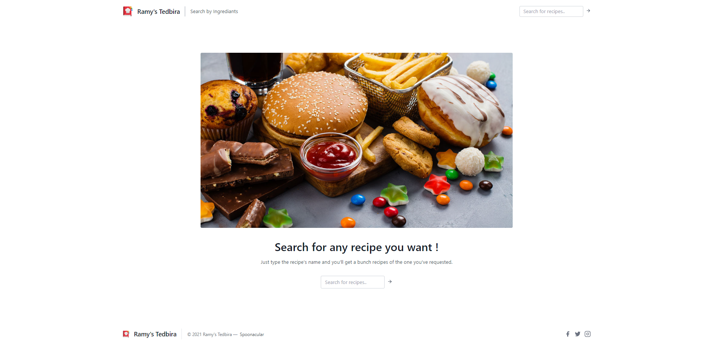

# Ramy's tedbira
A website (aka: webapp) to get food recipes by recipes names &amp; ingredients that you have in your fridge, using Django-framework and Spoonacular-api.

<b>Note:</b> The project isn't 100% Python, It also contains HTML files.

<b>Live website:</b> https://ramy-tedbira.herokuapp.com/

[Rami Berrekia](https://github.com/ramyberrekia) – [ramiberrekia1@gmail.com](mailto:ramiberrekia1@gmail.com)

## Run the project

To run this project you will need to set some environment variables.

1. Create a new file called `.env` inside the `food` folder
2. Copy all of the variables inside `food/.template.env` and assign your own values to them
3. - <b>In macOS:</b> Run `export READ_DOT_ENV_FILE=True` in your terminal so that your environment variables file will be read.
   - <b>In Windows:</b> Run `[System.Environment]::SetEnvironmentVariable('READ_DOT_ENV_FILE','True')` in your terminal so that your environment variables file will be read.
4. In your terminal, Run `python manage.py collectstatic` to collect static files. 
<b>Note:</b> make sure you've installed the required packages to run the server by running `pip install -r requirements.txt` in your terminal.

